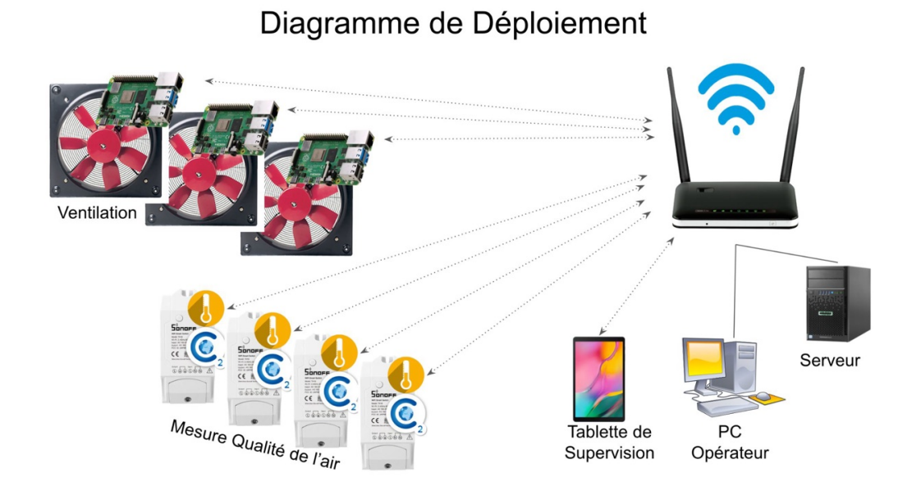

# Projet P2 : Supervision de Ventilation E.R.P. - BTS CIEL 2025

**Établissement :** Lycée Frédéric Ozanam, Lille
**Session :** 2025
**Section :** BTS CIEL - Option Informatique et Réseaux

## Description du Projet

Ce projet technique répond à une problématique sanitaire mise en lumière par la pandémie de COVID-19 : la nécessité de garantir une qualité de l'air optimale dans les Établissements Recevant du Public (ERP).

L'objectif est de développer un **système de supervision centralisé** pour la ventilation des espaces de travail. Ce système permet de :
1.  Mesurer la qualité de l'air (CO2, Température, Humidité).
2.  Piloter les groupes de ventilation de manière coordonnée depuis un point unique.
3.  Visualiser les données en temps réel et l'historique sur des interfaces ergonomiques (PC et Tablette).

## Objectifs Fonctionnels

Le système doit satisfaire les exigences suivantes :
* **Centralisation :** Piloter l'ensemble des groupes de ventilation d'un bâtiment.
* **Surveillance :** Remonter les alertes et mesures de qualité de l'air (CO2, Température, Humidité).
* **Historisation :** Stocker les données pour consulter des graphiques sur les dernières 24h.
* **Interfaces :** Double interface de supervision sur **Application PC** et **Application Android**.

---

## Architecture et Choix Techniques

Le système repose sur une architecture distribuée comprenant des modules de mesure, des modules de pilotage et des postes de supervision connectés via le réseau de l'entreprise.

### Spécifications Techniques

| Catégorie | Choix Techniques |
| :--- | :--- |
| **Langages** | Python ou C++ / WxWidgets |
| **OS Supportés** | Linux / Android / Tasmota |
| **Matériel (Hardware)** | PC / Raspberry Pi / Tablette / ESP8266 |
| **Base de données** | Centralisée (Type SQL) sur serveur |

### Interfaces Matérielles

| Interface / Fonction | Solution Retenue |
| :--- | :--- |
| **Pilotage Moteur (Sortie)** | Interface 0-10V (via convertisseur PWM) |
| **Mesure Débit (Entrée)** | Interface 4-20mA (Mesure Venturi -> convertisseur 0-10V) |
| **Module Mesure Air** | Sonoff TH16 (ESP8266) |
| **Capteur CO2** | MH-Z19 |
| **Capteur Temp/Hygro** | Capteur dédié sur Sonoff |
| **Boîtier** | Compatible rail normalisé (Habilitation PRE) |

---

## Répartition des Tâches

Le projet est réalisé par une équipe de 4 étudiants, avec des rôles distincts :

* **Étudiant 1 : Module de Mesure Qualité de l'Air**
    * Configuration firmware (Tasmota) sur ESP8266.
    * Interfaçage des capteurs (CO2, Temp, Hygro).
    * Transmission des mesures vers la BDD (Service de recueil).

* **Étudiant 2 : Module de Pilotage Ventilation**
    * Installation OS sur carte embarquée.
    * Pilotage moteur via sortie 0-10V.
    * Acquisition du débit d'air via entrée 4-20mA.
    * Asservissement aux consignes de la supervision.

* **Étudiant 3 : Supervision Poste Fixe (PC)**
    * Développement de l'application PC.
    * Visualisation cartographique des locaux.
    * Affichage des courbes historiques (24h).
    * Gestion de la Base de Données (Installation, sécurisation).

* **Étudiant 4 : Supervision Tablette & Infrastructure**
    * Développement de l'application Android (Tablette).
    * Visualisation et pilotage mobile.
    * Configuration de l'infrastructure réseau (Borne WIFI, DHCP, Routage).

---

## Schémas du Système

